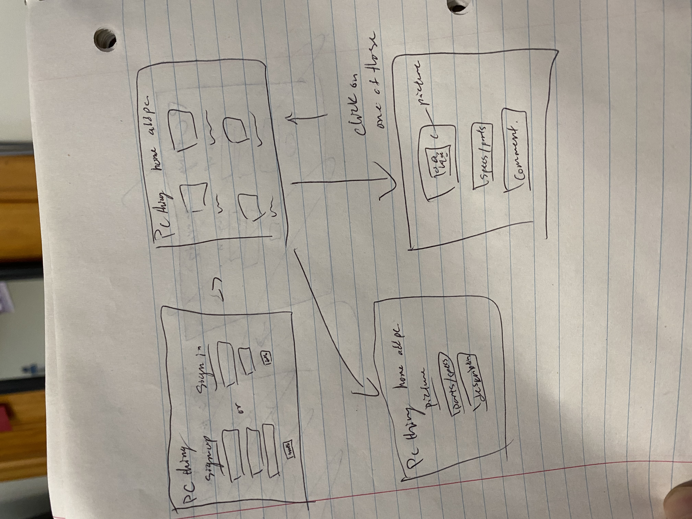
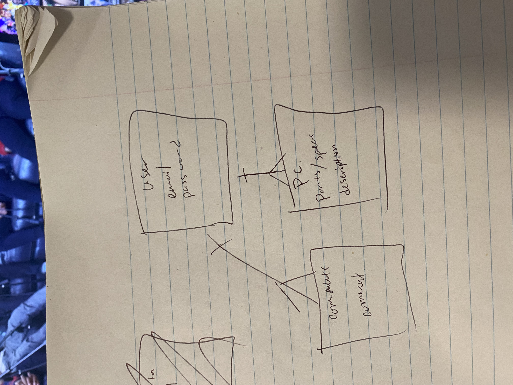
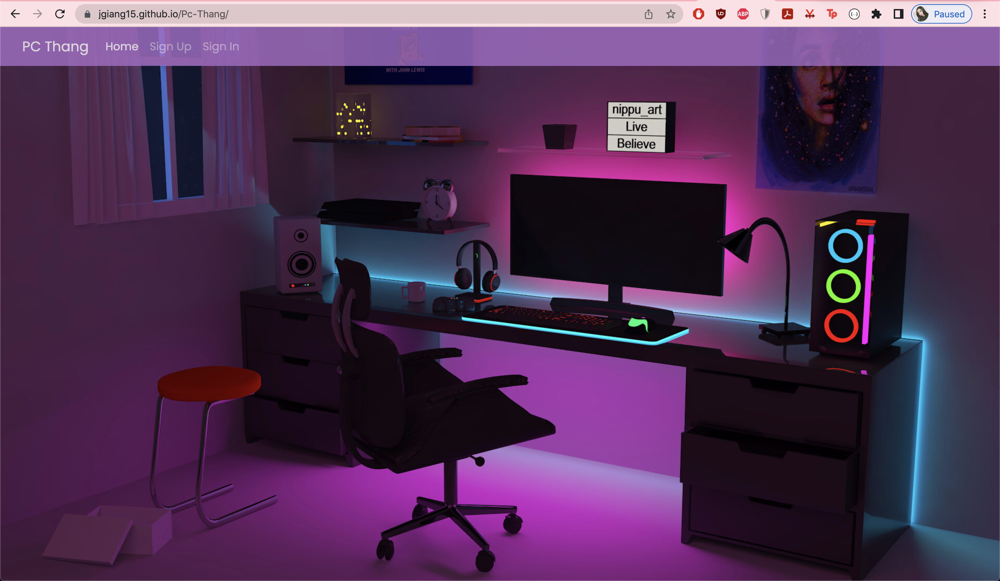

# PC-Thang

- [Pc-Thang](https://jgiang15.github.io/Pc-Thang/)
- [Front-End Repo](https://github.com/jgiang15/Pc-Thang)
- [Front-End Repo](https://github.com/jgiang15/Pc-Thang-Api)
- [Front-End Deployed](https://jgiang15.github.io/Pc-Thang/)
- [Back-End Deployed](https://still-chamber-03601.herokuapp.com)

### Overview:
Create and account and create posts for others to see the specs of your PC

### Rules:
You must have an account to begin posting. Create an account using the sign up link.

**_THIS IS A DUMMY APPLICATION. Do not enter real passwords, or passwords you have used anywhere else!_**

Once the account is created: create posts and add specs to them

### Wireframes: 

### ERD: 

### Application: 

### User stories: 
- As an unregistered user, I would like to sign up with email and password.
- As a registered user, I would like to sign in with email and password.
- As a signed in user, I would like to change password.
- As a signed in user, I would like to sign out.
- As a signed in user, I would like to create a post 
- As a signed in user, I would like to update my specs 
- As a signed in user, I would like to delete my post/specs.
- As a signed in user, I would like to see all posts and specs.

### Project Planning
- first had to think of idea for the project. I had thought about things that I am interested in, that is why I did a project about PC parts
- Had to create a Wireframe and ERD 
- Created a schedule to accomplish daily 
- Solved errors and carefully scanning code
- reached out to class mates to help with issues and also used class issue threads.

### Installation instructions
- Fork and clone this repository
- Run npm install to install dependencies 
- Checkout to a new branch ex: git checkout -b training
- cd into the new branch
- Run the front end application with npm start

### Technologies Used:

## Front-End:
- Javascript
- React
- HTML/CSS
- Bootstrap
- Axios

## Back-end:
- Javascript
- Express.js
- MongoDB
- Mongoose

### Future goals
- We wanted the users to be able to add images to posts.
- Want to be able to add comments to others posts
- want to be able to add to the homepage
- add a chat system

### API End Points

| Verb   | URI Pattern            | Controller#Action |
|--------|------------------------|-------------------|
| POST   | `/sign-up`             | `users#signup`    |
| POST   | `/sign-in`             | `users#signin`    |
| DELETE | `/sign-out`            | `users#signout`   |
| PATCH  | `/change-password`     | `users#changepw`  |
| GET    | `/posts`               | `surveys#index`     |
| POST   | `/posts`               | `posts#create`    |
| GET    | `/posts/:id`           | `posts#show`      |
| PATCH  | `/posts/:id`           | `posts#update`    |
| DELETE | `/posts/:id`            | `posts#destroy`   |
| POST   | `/specs`               | `specs#create`    |
| PATCH  | `/specs/:id`           | `specs#update`    |
| DELETE | `/specs/:id`            | `specs#destroy`   |
